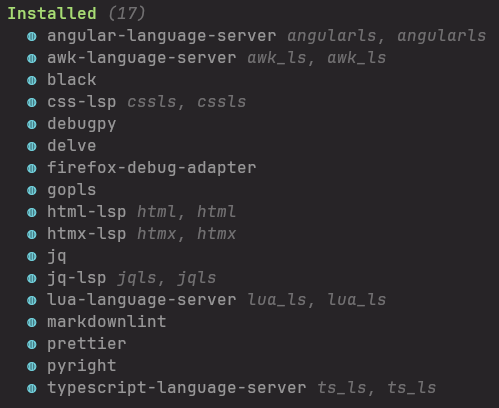
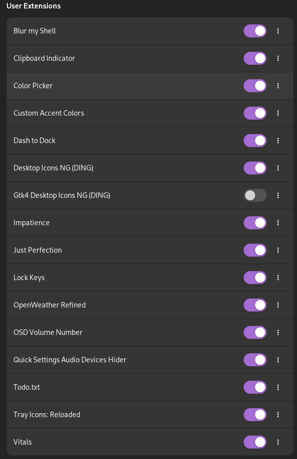

```
                   -`                
                  .o+`               
                 `ooo/               
                `+oooo:              
               `+oooooo:             
               -+oooooo+:            
             `/:-:++oooo+:           
            `/++++/+++++++:          
           `/++++++++++++++:         
          `/+++ooooooooooooo/`       
         ./ooosssso++osssssso+`      
        .oossssso-````/ossssss+`     
       -osssssso.      :ssssssso.    
      :osssssss/        osssso+++.   
     /ossssssss/        +ssssooo/-   
   `/ossssso+/:-        -:/+osssso+- 
  `+sso+:-`                 `.-/+oso:
 `++:.                           `-/+
 .`                                 `/
```

### Arch Install
#### 0. Getting image ready
```bash
https://archlinux.org/download/

sha256sum -b yourfile.iso
gnome-disk-image-monter
# https://etcher.balena.io/#download-etcher
```

#### 1. Verifying boot and maybe setting font
```bash
efivar -l

setfont ter-u20b
```

#### 2. Internet connection
```bash
ip link

iwctl
help
device list
station wlan0 scan
station wlan0 get-networks
station wlan0 connect ¨AP 81 - 5G¨
exit

ping archlinux.org
```

#### 3. Disk partitioning

| Type | Size |
|--------------- | --------------- |
| EFI | +2G |
| SWAP | +16G |
| ROOT | |
<!-- |    |    | -->

If disk is in use, might have to reboot right after creating partition
##### Patitioning
```bash
fdisk -l
fdisk /dev/nvme0n1
m
p
l
n
t

1 19 23
...
w
```

##### Types
```bash
mkfs.fat -F32 /dev/nvme0n1p5
mkswap /dev/nvme0n1p6
mkfs.ext4 /dev/nvme0n1p7
```

##### Mounting
```bash
# mount -o fmask=0077,dmask=0077 --mkdir /dev/nvme0n1p1 /mnt/boot
mount /dev/nvme0n1p7 /mnt
mount --mkdir /dev/nvme0n1p5 /mnt/boot
swapon /dev/nvme0n1p6
```

#### 4. Pacman setup
```bash
sudo pacman -Sy archlinux-keyring pacman-contrib
```

```bash
vim /etc/pacman.conf

parallel 10
uncomment colors
```

#### 5. Update Image & Root
```bash
pacstrap -K /mnt base linux linux-firmware
```

##### Fstab
```bash
genfstab -U -p /mnt > /mnt/etc/fstab
cat /mnt/etc/fstab
```

##### Chroot
```bash
arch-chroot /mnt
mount --mkdir /dev/nvme0n1p2 /mnt/win #(windows EFI)
```

##### Install Basics to disk
```bash
pacman -Sy neovim archlinux-keyring pacman-contrib
```

#### 6. Pacman
##### Mirrors
```bash
cp /etc/pacman.d/mirrorlist /etc/pacman.d/mirrorlist.backup
rankmirrors -n 10 /etc/pacman.d/mirrorlist.backup > /etc/pacman.d/mirrorlist
```

##### Parallel and 32bit
```bash
vim /etc/pacman.conf

color
parallel 15
/multilib
```

##### Essentials
```bash
pacman -Syu
pacman -S --needed sudo amd-ucode linux-headers networkmanager git base-devel xclip tilix firefox stow openssh

intel-ucode
iucode-tool 
dhcpcd 
```

#### 7. Language & Time
```bash
nvim /etc/locale.gen

/en_US.UTF-8
```

```bash
locale-gen
echo LANG=en_US.UTF-8 > /etc/locale.conf
export LANG=en_US.UTF-8

ln -s /usr/share/zoneinfo/America/Sao_Paulo > /etc/localtime
hwclock --systohc --utc
```

#### 8. Hostname & User
hostname = machine name
```bash
echo arch-hostname > /etc/hostname
nvim /etc/hosts

127.0.0.1 localhost
127.0.0.1 arch-pc
```

```bash
passwd
useradd -m -g users -G wheel,storage,power -s /bin/bash calvo
passwd calvo

EDITOR=nvim visudo
/%wheel # just to find it

# User privilege specification
root	ALL=(ALL:ALL) ALL
calvo	ALL=(ALL) ALL

G
Defaults rootpw
```

#### 9. Boot
##### Grub
```bash
pacman -S --needed grub efibootmgr os-prober
grub-install --targe=x86_64-efi --efi-directory=/mnt/win --bootloader-id=GRUB

mount --mkdir /dev/nvme0n1p1 /mnt/boot/efi
grub-install --targer=x86_64-efi --bootloader-id=GRUB

nvim /etc/default/grub
GRUB_DISABLE_OS_PROBER=false
GRUB_DISABLE_SUBMENU=y
GRUB_SAVEDEFAULT=true
GRUB_COLOR_NORMAL="light-blue/black"
GRUB_COLOR_HIGHLIGHT="light-cyan/black"
GRUB_TIMEOUT=3
GRUB_CMDLINE_LINUX_DEFAULT="loglevel=3 quiet ipv6.disable=1 pcie_aspm=off"
# GRUB_DEFAULT=3

os-prober
grub-mkconfig -o /boot/grub/grub.cfg

exit
reboot
sudo os-prober
sudo grub-mkconfig -o /boot/grub/grub.cfg
```

##### systemd-boot
```bash
ls /sys/firmware/efi/efivars
mount -t efivarfs efivarfs /sys/firmware/efi/efivars/
bootctl install
nvim /boot/loader/entries/arch.conf
```

```bash
title Arch
linux /vmlinuz-linux
initrd /intel-ucode.img /amd-ucode.img
initrd /initramfs-linux.img
```

```bash
echo "options root=PARTUUID=$(blkid -s PARTUUID -o value /dev/nvme0n1p3) rw nvidia-drm.modeset=1" >> /boot/loader/entries/arch.conf
cat /boot/loader/entries/arch.conf
```

#### 10. Nvidia & Image
```bash
pacman -S nvidia-dkms libglvnd nvidia-utils opencl-nvidia lib32-libglvnd lib32-nvidia-utils lib32-opencl-nvidia nvidia-settings
```

```bash
nvim /etc/mkinitcpio.conf

MODULES=(nvidia nvidia_modeset nvidia_uvm nvidia_drm)
HOOKS(= -kms)
```

```bash
mkdir /etc/pacman.d/hooks
nvim /etc/pacman.d/hooks/nvidia.hook

[Trigger]
Operation=Install
Operation=Upgrade
Operation=Remove
Type=Package
Target=nvidia

[Action]
Depends=mkinitcpio
When=PostTransaction
Exec=/usr/bin/mkinitcpio -P
```

```bash
nvim /etc/pacman.d/hooks/grub.hook

[Trigger]
Type = File
Operation = Install
Operation = Upgrade
Operation = Remove
Target = usr/lib/modules/*/vmlinuz

[Action]
Description = Updating grub configuration ...
When = PostTransaction
Exec = /usr/bin/grub-mkconfig -o /boot/grub/grub.cfg
```

```bash
mkinitcpio -P
```

#### 11. Services
```bash
sudo systemctl enable fstrim.timer |
sudo systemctl enable NetworkManager.service |
sudo systemctl enable systemd-resolved |
sudo systemctl enable paccache.timer
```

#### 12. Reboot
```bash
exit (until red)
umount -R /mnt
reboot
```

#### 13. Internet
```bash
nmtui
ping archlinux.org

ip link
sudo systemctl enable dhcpcd@wlo1.service
```

#### 14. Display Manager
##### BSPWM
```bash
sudo pacman -S xterm bspwm sxhkd picom nitrongen unclutter xorg xorg-xinit polybar dunst ly slock --needed

xrandr --listmonitors
mkdir .config/sxhkd
nvim .config/sxhkd/sxhkdrc
```

```bash
super + Return
    tilix

super + 1
    xterm

super + 2
    reboot

super + 3
    xrandr --output eDP-1-1 --mode 1920x1080

super + 4
    xrandr --output HDMI-1-1 --mode 1920x1080
```

```bash
nvim /usr/share/xsessions/bspwm.desktop
Exec=bspwm & sxhkd

systemctl enable ly.service
startx

# might need
nvim .xinitrc
#!/bin/bash
exec bspwm
exec sxhkd

reboot
```

```bash
super + enter
picom &
```

###### Troubleshooting
```bash
sudo X --configure
sudo nvidia-xconfig
nvim ~/.local/share/xorg/Xorg.0.log

mv /etc/X11/xorg.conf /etc/X11/xorg.conf.backup
mv /root/xorg.conf.new /etc/X11/xorg.conf

nvim /usr/share/xsessions/bspwm.desktop
bspwm & sxhkd

nvim .xinitrc
#!/bin/bash
exec bspwm
exec sxhkd

systemctl --user calvo --global enable
export XDG_RUNTIME_DIR="/run/user/$UID"
export DBUS_SESSION_BUS_ADDRESS="unix:path=$(XDG_RUNTIME_DIR)/bus"

lsmod | grep nvidia
cat /sys/class/drm/*/status

mkdir ~/.config/bspwm
nvim bspwmrc
#!/bin/bash

tty2, tty3 (ctrl + alt + f2, f3)
DISPLAY=:0 xrandr
sxhkd -> super + 2, reboot
sxhkd -> super + 3, 
sxhkd -> super + 4, xrandr --output HDMI-1-1 --auto

xrandr --output eDP-1-1 --mode 1920x1080
```

Tilix -> Preferences -> Apearance -> Theme Variant -> Dark

##### Gnome
View # 31

#### 15. Clone repos
```bash
mkdir code
ssh-keygen -t rsa
cd /home/calvo/.ssh
xclip -sel c id_rsa.pub

firefox
clone linux
clone scripts
```

#### 16. Stow & Tilix
```bash
stow --target="/home/calvo" --dir="/home/calvo/code/linux/dotfiles" -v --simulate . 
stow --target="/home/calvo" --dir="/home/calvo/code/linux/dotfiles" -v --adopt . 
sh ~/code/scripts/define-links.sh

cd ~/code/linux/dotfiles/.config/
mkdir x 
mv ~/.config/x/* ~/code/linux/dotfiles/x
stow --target="/home/calvo/.config/x" --dir="/home/calvo/code/linux/dotfiles/.config/x" -v --simulate .
```

```bash
cd ~/code/linux
dconf load /com/gexperts/Tilix/ < tilix.dconf

# dconf dump /com/gexperts/Tilix/ > tilix.dconf 
```

#### 17. Directories
```bash
mkdir desktop |
mkdir documents |
mkdir videos |
mkdir downloads |
mkdir misc |
mkdir books |
mkdir images |
mkdir lists |
mkdir apps
```

```bash
cd apps |
mkdir appimages |
cd ..|
cd images |
mkdir icons |
mkdir wallpapers |
mkdir screenshots
```


#### 18. Yay
```bash
sudo pacman -Syu

cd apps
git clone https://aur.archlinux.org/yay.git
cd yay
makepkg -si
```

#### 19. Installing
##### Libraries
```bash
sudo pacman -S --needed noto-fonts-cjk noto-fonts-emoji noto-fonts gnu-free-fonts noto-fonts \
ttf-jetbrains-mono ttf-liberation noto-fonts-emoji vulkan-icd-loader lib32-vulkan-icd-loader vulkan-tools \
ttf-nerd-fonts-symbols-mono fuse2 fuse3 libxkbcommon-x11 unrar p7zip vulkan-intel lib32-vulkan-intel \
clutter clutter-gtk inkscape ripgrep rofi playerctl numlockx lm_sensors xdg-user-dirs-gtk gnome-backgrounds \
pulseaudio sox dosfstools
```

##### Apps
```bash
sudo pacman -S --needed fastfetch qbittorrent screen xdotool python-pip krita flameshot nodejs npm \
calibre ffmpeg dconf-editor trash-cli xarchiver-gtk2 fish jq fzf tldr bat eza zoxide mpv \
stress glmark2 neovide fail2ban ufw imagemagick pavucontrol feh yazi pandoc python-weasyprint \
clipcat calcurse xcolor gnome-system-monitor nautilus gnome-terminal iftop figlet gnome-disk-utility \
progress evince docker
```

```bash
steam
discord
drawing
task
taskwarrior-tui
ncdu
```

##### AUR
```bash
yay -S polychromatic wezterm qdirstat youtube-music ahk_x11-bin anki ttf-juliamono ttf-weather-icons ttf-kanjistrokeorders cava gnome-characters
```

```bash
tetrio
vscodium
```

##### DeepSeek
```bash
curl -fsSL https://ollama.com/install.sh | sh
ollama --version
sudo systemctl enable ollama.service
ollama run deepseek-r1:7b
```

```bash
sudo pacman -Sy
sudo pacman -S docker nvidia-container-toolkit --needed
sudo usermod -Ag docker $USER
bash
newgrp docker
reboot

docker run -d --network=host -v open-webui:/app/backend/data -e OLLAMA_BASE_URL=http://127.0.0.1:11434 --name open-webui --restart always ghcr.io/open-webui/open-webui:main
docker ps -a
docker stop
```

#### 20. Websites
##### AppImages
```bash
https://www.onlyoffice.com/download-desktop.aspx
https://github.com/Nixola/VRRTest/releases/
https://etcher.balena.io/
```

##### Must Compile
[Btop](https://github.com/aristocratos/btop?tab=readme-ov-file#compilation-linux) 
```bash
cd ~/apps
git clone https://github.com/aristocratos/btop.git
cd btop
make GPU_SUPPORT=true VERBOSE=true
sudo make install
```

#### 21. System Config
##### Directories
```bash
rm Pictures Music Videos Documents Downloads Templates Public Desktop

cp ~/code/linux/files/icons/* ~/images/icons/
sudoedit /etc/xdg/user-dirs.defaults
nvim ~/.config/user-dirs.dirs
```

##### Misc I
```bash
dconf write /system/locale/region "'en_GB.UTF-8'" |
git config --global user.email "igorcalvob@gmail.com" |
git config --global user.name "igorcalvo" |
xdg-settings set default-web-browser firefox.desktop
```

##### Time
```bash
timedatectl set-timezone America/Sao_Paulo |
timedatectl set-ntp true |
timedatectl status
```

```bash
reboot
```

##### Misc II
```bash
sudo modprobe razerkbd
sudo gpasswd -a $USER plugdev
curl --proto '=https' --tlsv1.2 -sSf https://sh.rustup.rs | sh
sudo sensors-detect

sudo pacman -S bluez
sudo systemctl enable bluetooth 
```

##### Neovim
```bash
cd ~/.local/share/nvim/mason/
```

/

#### 22. Startup
```bash
sudo sh ~/code/scripts/bspwm.sh
```

#### 23. Python
##### fuck pysimplegui
```bash
sudo pacman -S python-pandas python-numpy python-scipy python-matplotlib python-beautifulsoup4 \
python-openpyxl python-requests python-pyperclip python-opencv python-debugpy python-pywal \
python-virtualenv jupyter-notebook yt-dlp python-flask python-pillow python-numba \
cython mypy --needed
```

```bash
yay -S python-yarg python-pipreqs
```

```bash
sudo rm /usr/lib/python3.12/EXTERNALLY-MANAGED

selenium 
```

#### 24. Files
```bash
start krita
cp ~/code/linux/files/krita-workspace.kws ~/.local/share/krita/workspaces/

cp ~/code/linux/files/icons/* ~/images/icons/
# sudo cp ~/code/linux/files/dotdesktops/* /usr/share/applications/

MEGA
games?
```

#### 25. Applications
```
Razer
    500 Dpi
Qbittorrent
    Downloads
        destination at ~/downloads/
        disable popup
    Behavior
        confirm when deleting torrents false
Steam
    Login
    In Game
        FPS Counter Top Right
        High Contrat True
    Notifications
        Disable friend join game
    Compatibility
        Enable Steam Play for all other titles
            Proton 9.0-2
    cs2 launch options
        -fullscreen -sdlaudiodriver pipewire
Discord
    Login
    Voice & Video Defaults
    Keybindings
        Toggle Mute
        Push to Mute
Youtube Music
    Login
Firefox
    Download directory
    Remove
        Import bookmarks
        Getting Started
        Spaces
    Icons and Logins
    Theme Beautiful Alpen Blue
    Search -> Brave
    Extensions
        Blocksite
            chess.com
            lichess.org
            p
    Unhook
        Recommended
    Youtube Enhancer
        Dark theme
        Place Controls Within the Player
        1080
    Momentum
        New tab -> Name
Krita
    Load workspace -> Last
    Themes -> Krita Darker
Nvidia
    Sudo
    OpenGL Settings
        Gsync Indicator
    PowerMizer -> Performance
    Save
Pavucontrol
    Configuration
        Disable what's necessary
    Input Devices
        150%
VS Codium
    Two Monokai
    Keyboard Shortcuts
        Copy Line Down - Shift Alt Down
```

#### 26. Anki
Download decks from MEGA

Addons:
- 1771074083 heatmap
- 3918629684 japanese support
- 613684242 true retention
- 947935257 reset ease
- 1152543397 postpode cards's review
- 1084228676 color confirmation
- 1610304449 kanji grid
- 1136455830 advanced review button bar
<!-- - 2494384865 buttons colors -->

Old Deck settings
```
Add Ons "config" interval coefficient 0.0
30	9999	off	1m 5m 15m	1	4	Sequential
2m 7m	1	6	 Tag Only	Deck	Card type	 Show after reviews	Show after reviews	 Due date, then random
600	off	off	off	off	off	off	
180	2.5	1.3	1	1.2	0

Change to default OS theme to prevent crashes
Also, it might be possible not to rebind numpad keys
```
    
#### 27. Security
```bash
sudo ufw limit 22/tcp |
sudo ufw allow 80/tcp |
sudo ufw allow 443/tcp |
sudo ufw allow from 88.99.58.246 |
sudo ufw default deny incoming |
sudo ufw enable
```

```bash
# https://www.networkworld.com/article/968526/linux-firewall-basics-with-ufw.html

iftop
anki
ping sync3.ankiweb.net
allow from
```

```bash
sudoedit /etc/fail2ban/jail.local

[DEFAULT]
ignoreip = 127.0.0.1/8 ::1
bantime = 3600
findtime = 600
maxretry = 5

[sshd]
enabled = true
```

```bash
sudo systemctl enable fail2ban
sudo systemctl start fail2ban
```

#### 28. Backup Kernel
```bash
sudo pacman -S linux-zen-headers linux-zen
# nvidia-lts
```

##### grub
nothing to do if hook was enabled

##### systemd-boot
```bash
sudo su
cd /boot/loader/entries
cp arch.conf arch-lts.conf

append -zen to linuz and to fs
reboot and hold 't'
```

#### 29. Ricing
##### Display Manager
```bash
sudoedit /etc/ly/config.ini

fg = 7
border_fg = 5
```

##### Wallpaper
1. Get it
2. Krita
3. Nitrogen

```bash
nitrogen ~/images/wallpapers/2024-06/pc/wallpaper5.png --set-auto --save
```

##### Cursors
Volantes Cursors
Light
https://github.com/varlesh/volantes-cursors
https://www.gnome-look.org/p/1356095

```bash
cd apps
git clone git@github.com:varlesh/volantes-cursors.git
cd volantes-cursors
sudo make build
sudo make install
```

```bash
nvim ~/.config/gtk-3.0/settings.ini
gtk-cursor-theme-name=volantes_light_cursors
```

##### Steam Theme
```bash
cd
cd apps
git clone https://github.com/tkashkin/Adwaita-for-Steam
cd Adwaita-for-Steam
python install.py
```

##### Colors
```bash
edit ~/colors.sh
python ~/code/rice/load_colors.py
python offset_colors.py ~/.config/rofi/rounded-pink-dark.rasi 0.5
```

#### 30. Useful
```bash
sudo -i
sudo su
xev # events, to find key names
fc-list | grep Mono # list font names
```

#### 31. Gnome
```bash
sudo pacman -S xorg gnome --needed

enter
? = backgrounds
?? = terminal
4,6,8,14,15,16,18,20,23,25,26,28,48,58, ?, ??

gdm
calculator
chracters
control-center
disk-utility
font-viwer
logs
menus
session
shell
shell-extensions
system-monitor
nautilus
user-dirs-gtk
```

```bash
sudo systemctl start gdm

sudo systemctl enable gdm
systemctl reboot
```

##### Apps
```bash
sudo pacman -S --needed dconf-editor gnome-tweaks
yay extension-manager gdm-settings
```

##### Gnome Settings 
```
Displays
    Layout
    Frequencies
Multitasking
    General
        Hot Corner
            Off
    Workspaces
        1
Appearance
    Dark
Power
    Dim Screen
    Screen Blank
        5 Minutes
    Automatic Suspend
        When on Battery
    Power Button
        Suspend / Power Off
    Show Batter Percentage
        On
Mouse & Touchpad
    Mouse
        Mouse Acceleration
            Off
    Touchpad
        Secondary Click
            Corner Push
System
    Region & Language
        Language    - English (US)
        Formats     - United Kingdom
    Date & Time
        Automatic Date & Time
            On
        Time Zone
            Sao Paulo, Brazil
```

##### Dconf
```bash
dconf write /org/gnome/desktop/background/picture-options "'spanned'" |
dconf write /org/gnome/desktop/wm/preferences/focus-new-windows "'smart'" |
dconf write /org/gnome/settings-daemon/plugins/media-keys/volume-step 2 |
dconf write /org/gnome/desktop/interface/clock-show-seconds true |
dconf write /org/gnome/desktop/interface/clock-show-weekday true |
dconf write /org/gnome/desktop/interface/clock-show-date true |
dconf write /org/gnome/desktop/interface/clock-format "'24h'" |
dconf write /org/gnome/desktop/calendar/show-weekdate true |
dconf write /org/gnome/settings-daemon/plugins/color/night-light-enabled true |
dconf write /org/gnome/settings-daemon/plugins/color/night-light-schedule-automatic false |
dconf write /org/gnome/settings-daemon/plugins/color/night-light-schedule-from 20 |
dconf write /org/gnome/settings-daemon/plugins/color/night-light-schedule-to 8 |
dconf write /org/gnome/settings-daemon/plugins/color/night-light-temperature 3165 |
dconf write /org/gnome/mutter/dynamic-workspaces false |
dconf write /org/gnome/desktop/interface/show-battery-percentage true |
dconf write /org/gnome/desktop/interface/color-scheme "'default'" |
dconf write /org/gnome/desktop/input-sources/mru-sources "[('xkb', 'us')]" |
dconf write /org/gnome/desktop/input-sources/sources "[('xkb', 'us'), ('xkb', 'us+intl')]" |
dconf write /system/locale/region "'en_GB.UTF-8'"
```

##### Ricing
###### Icons
Kora
Green or Yellow <br>
https://www.gnome-look.org/s/Gnome/p/1256209 <br>
https://github.com/bikass/kora

```bash
cd apps
git clone git@github.com:bikass/kora.git
cd kora
cd apps/scalable
find . -name 'discord*' | xargs sudo rm {}
find . -name 'steam*' | xargs sudo rm {}
find . -name 'youtube*' | xargs sudo rm {}
cd ../..
rm icon-theme.cache
sh create-new-icon-theme.cache.sh
cd ..
sudo cp kora/ /usr/share/icons/
```

###### Theme
Marble Shell theme <br>
https://www.gnome-look.org/p/1977647

```bash
git clone https://github.com/imarkoff/Marble-shell-theme.git
cd Marble-shell-theme
python install.py --blue --mode=dark --filled

cd ~/.themes/Marble-blue-dark/gnome-shell/
nvim gnome-shell.css

/ Panel
font-size: 15px;
/ Popovers
background: rgba(18, 20, 21, 1); 
```

###### Desktops
```bash
sudo cp ~/code/linux/files/dotdesktops/* /usr/share/applications
```

###### Extensions


 ```bash
dconf dump /org/gnome/shell/extensions/ > extensions.dconf
dconf load /org/gnome/shell/extensions/ < files/dumps/extensions.dconf
```

```
Impatience
    0.5
Dash to Dock
    Behavior
        Click action                Raise window
    Appearance
        Show overview on startup    false
        Use built-in theme          true
Just Perfection
    Behavior
        Startup Status              Desktop
Gt4 Desktop Icons
    Files
        Show hidden files               true
Quick Settings Audio Devices Hider
    Hide All But
        Analog Output 7.1 HyperX
        Line Out - Starship/Mantisse HD
Todo.txt
    Click to create file
```

###### Colors
```bash
python code/rice/offset_colors.py ~/.themes/Marble-blue-dark/gnome-shell/gnome-shell.css -0.3
nvim /home/calvo/.local/share/gnome-shell/extensions/custom-accent-colors@demiskp/resources/purple/gtk.css
```


